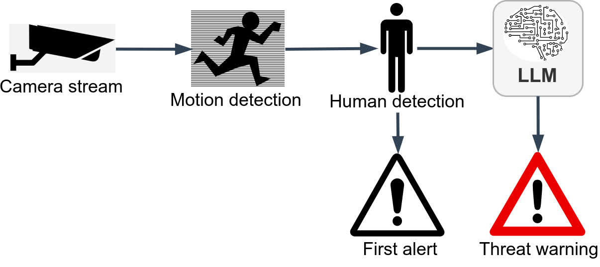

<!-- Copyright (c) 2024 Praneeth Vadlapati -->

#  AutoWatcher

## Real-time context-aware security alert system using LLMs

> [!NOTE]
> Please star :star: the repository to show your support.  

<!-- Workflow images -->
**AutoWatcher process**:  

### Why AutoWatcher:
- Automated threat monitoring is currently not intelligent or
	context-aware based on custom instructions.
- Existing threat prediction models require training data and time.
- This project uses existing models for motion detection and human detection,
	and uses LLMs for real-time context-aware threat prediction.

Created by Praneeth Vadlapati ([@prane-eth](https://github.com/prane-eth))

## :page_facing_up: Research Paper
The research paper is available at https://doi.org/10.55041/IJSREM33034  

## :rocket: Quick Start
Open the file [Experiment-AW.ipynb](Experiment-AW.ipynb)
	and find the setup instructions in the first cell.
Run the code.  

## :computer: More Projects
For more projects, open the profile: **[@Pro-GenAI](https://github.com/Pro-GenAI)**  

## :identification_card: License
Copyright &copy; 2024 Praneeth Vadlapati  
Please refer to the [LICENSE](./LICENSE.md) file for more information.  
To request a permission to use my work, please contact me using the link below.

## :warning: Disclaimer
The code is not intended for use in production environments.
This code is for educational and research purposes only.
No author is responsible for any misuse or damage caused by this code.
Use it at your own risk. The code is provided as is without any guarantees or warranty.

## :globe_with_meridians: Acknowledgements
- Special thanks to **Groq** (https://groq.com/) for a fast LLM inference which saved me time for this research project.
- Flowchart image credits:
	- Camera: https://pixabay.com/vectors/silhouette-security-cam-speed-3613225/
	- Motion detection: https://pixabay.com/vectors/sprinting-running-jogging-sports-150117/
	- Human detection: https://pixabay.com/vectors/mens-locker-room-man-human-toilet-155828/
	- LLM: https://pixabay.com/vectors/circuits-brain-network-chip-5076887/
	- First alert: https://pixabay.com/vectors/exclamation-mark-warning-danger-98739/
	- Threat warning: https://pixabay.com/vectors/traffic-sign-attention-road-sign-38589/

## :email: Contact
For personal queries, please find my contact details here: [linktr.ee/prane.eth](https://linktr.ee/prane.eth)

